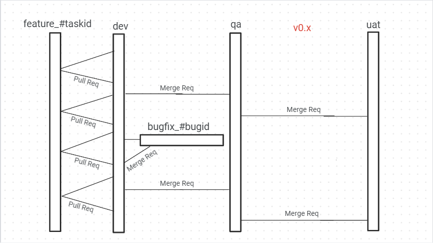

This is a [Next.js](https://nextjs.org/) project bootstrapped
with [`create-next-app`](https://github.com/vercel/next.js/tree/canary/packages/create-next-app).

## Tech stack

```
- Redux Toolkit: for state management
- Pusher: for socket based communication 
- Ant Design: for design 
- Tailwind CSS: for styling 
- Jest: for unit testing
```

## Installation

1. Clone the repository:

```bash
git clone git@github.com:DulanWirajith/pickles-ui.git
```

2. Install dependencies:

```bash
cd pickles-ui
yarn install
```

## Running the app

First, run the development server:

```bash
npm run dev
# or
yarn dev
# or
pnpm dev
```

## Proofs


### Git Workflow


